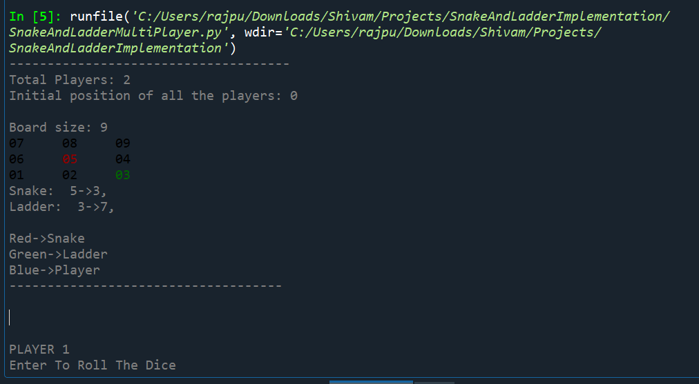
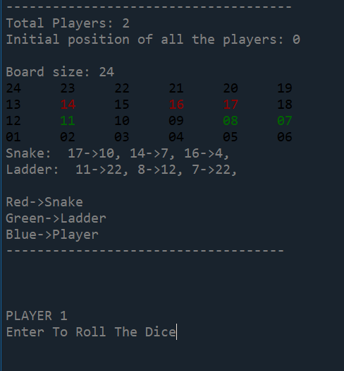
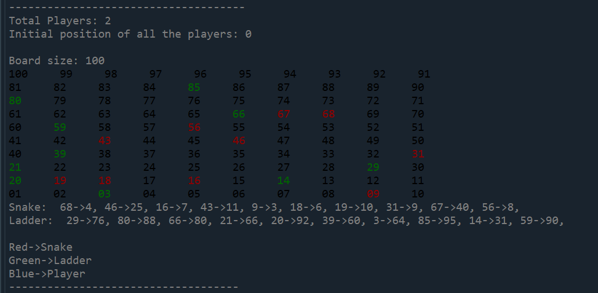
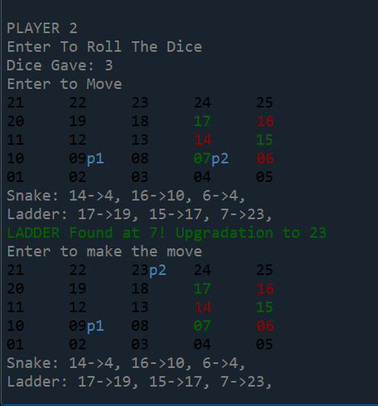

# Snake-And-Ladder-Implementation
I tried to implement snake and ladder in a different way. This version of Snake and Ladder is different from a conventional Snake and Ladder. 
Its features: 
1. We can have a board of any size and of any dimension. 
   For Example: 3X3, 10X10, 4X6, etc 
2. The snakes and the ladders are generated randomly depending upon the size of the board. 
   For Example: if the board is 10X10, the code will generated 10 ladders and 10 snakes randomly 
                if the board is 3X3, the code will generate 1 ladder and 1 snake randomly 
                if the board is 4X6, the code will generate 3 ladders and 3 snakes randomly 
   
    
   
3. We can have any number of players from 1 to many. 
4. The code prints the board, and all the other details like ladder, snake, and the player position with colours. 
   

             
